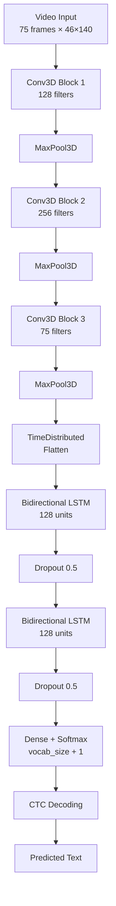

# Deep Lip Reading Project

<div align="center">

**An end-to-end deep learning project for lip reading from video**

[](https://www.python.org/)
[](https://www.tensorflow.org/)
[](LICENSE)

*Designed for accessibility applications*

</div>

---

An end-to-end deep learning project for lip reading from video, designed for accessibility applications. This project implements a Conv3D + Bidirectional LSTM + CTC architecture similar to LipNet, capable of transcribing speech from mouth region video clips.

## Overview

This project builds a machine learning model that can read lips from video sequences (mouth region only). The model uses:
- **3D Convolutional Networks** to extract spatiotemporal features from video frames
- **Bidirectional LSTM** layers to model temporal dependencies
- **CTC (Connectionist Temporal Classification)** loss for sequence-to-sequence learning

## Architecture

### Model Pipeline

```
Video Input (75 frames)
    ↓
[Mouth Region Extraction]
    ↓
[Grayscale + Normalization]
    ↓
Conv3D Block 1 (128 filters) → MaxPool3D
    ↓
Conv3D Block 2 (256 filters) → MaxPool3D
    ↓
Conv3D Block 3 (75 filters) → MaxPool3D
    ↓
TimeDistributed Flatten
    ↓
Bidirectional LSTM (128 units) → Dropout (0.5)
    ↓
Bidirectional LSTM (128 units) → Dropout (0.5)
    ↓
Dense Layer (Softmax, vocab_size + 1)
    ↓
CTC Decoding
    ↓
Predicted Text
```

### Architecture Details

The model architecture consists of:
1. **Input**: Video clips of shape `[batch, 75, H, W, 1]` (75 frames, grayscale mouth region)
2. **Conv3D Blocks**: Three 3D convolutional layers with MaxPool3D to extract features
3. **TimeDistributed Flatten**: Collapses spatial dimensions while preserving temporal dimension
4. **Bidirectional LSTM**: Two layers with 128 units each for sequence modeling
5. **Dropout**: Regularization (0.5 rate)
6. **Dense Output**: Softmax layer with `vocab_size + 1` outputs (characters + CTC blank token)

**Total parameters**: ~8-9 million

### Visual Architecture Diagram

<div align="center">
  
</div>

**Interactive Mermaid Diagram:**


## Project Structure

```
deeplip/
├── requirements.txt          # Python dependencies
├── README.md                # This file
├── src/
│   ├── __init__.py
│   ├── config.py            # Configuration and hyperparameters
│   ├── data.py              # Data loading and preprocessing
│   ├── dataset.py           # tf.data pipeline and vocabulary
│   ├── model.py             # Neural network architecture
│   ├── losses.py            # CTC loss function
│   ├── callbacks.py         # Training callbacks
│   ├── train.py             # Training script
│   ├── predict.py           # Inference script
│   └── visualize.py         # Visualization utilities
└── notebooks/               # Optional visualization notebooks
```

## Installation

1. **Clone the repository** (if applicable) or navigate to the project directory.

2. **Install dependencies**:
   ```bash
   pip install -r requirements.txt
   ```

   Required packages:
   - TensorFlow 2.x
   - NumPy
   - OpenCV-Python
   - Matplotlib
   - imageio
   - gdown

3. **Install development dependencies** (optional, for linting):
   ```bash
   pip install flake8 pytest pytest-cov
   ```

## Data Setup

### Downloading Data

The project expects video files (`.mpg`) and alignment files (`.align`) in the following structure:
```
data/
├── S1/
│   ├── video1.mpg
│   ├── video2.mpg
│   └── ...
└── alignments/
    └── S1/
        ├── video1.align
        ├── video2.align
        └── ...
```

To download data:
1. Update `DATA_URL` in `src/config.py` with your Google Drive file ID
2. Run the download function:
   ```python
   from src.data import download_and_extract_data
   download_and_extract_data()
   ```

Alternatively, manually place your data in the `data/` directory following the structure above.

### Data Format

- **Videos**: MPEG files containing face videos
- **Alignments**: Text files with format:
  ```
  start_time end_time token
  start_time end_time token
  ...
  ```
  Tokens marked as "silence" are automatically filtered out.

## Usage

### Training

To train the model:

```bash
python -m src.train --video_pattern "data/S1/*.mpg" --epochs 100
```

Arguments:
- `--video_pattern`: Glob pattern for video files (default: `data/S1/*.mpg`)
- `--epochs`: Number of training epochs (default: 100)

The training script will:
1. Load and preprocess videos and alignments
2. Build the tf.data pipeline with padding and batching
3. Split data into training (450 samples) and validation sets
4. Train the model with CTC loss
5. Save weights after each epoch to `models/` directory
6. Print example predictions at the end of each epoch

**Training Configuration**:
- Batch size: 2
- Learning rate: 1e-4 (constant for first 30 epochs, then exponential decay)
- Video frames: 75 (padded/truncated)
- Max text length: 40 tokens

### Prediction

To predict text from a video clip:

```bash
python -m src.predict path/to/video.mpg --weights models/weights_epoch_96.h5
```

Arguments:
- `video_path`: Path to video file
- `--weights`: Path to model weights file (default: `models/weights_epoch_96.h5`)

The script will:
1. Load the trained model
2. Preprocess the video (grayscale, crop mouth region, normalize)
3. Run inference using CTC decoding
4. Print the predicted text

### Visualization

To visualize what the model sees (preprocessed mouth region), use the visualization utility:

```python
from src.visualize import visualize_preprocessed_clip
visualize_preprocessed_clip("data/S1/video1.mpg", "animation.gif")
```

This creates an animated GIF showing the preprocessed mouth region frames that the model processes.

## Configuration

All hyperparameters and paths can be modified in `src/config.py`:

- **Data paths**: `DATA_DIR`, `DATA_URL`, `ALIGNMENTS_DIR`
- **Preprocessing**: `MOUTH_REGION`, `TARGET_FRAMES`, `MAX_TEXT_LENGTH`
- **Model**: `CONV3D_FILTERS`, `LSTM_UNITS`, `DROPOUT_RATE`
- **Training**: `BATCH_SIZE`, `EPOCHS`, `INITIAL_LEARNING_RATE`

## GPU Configuration

The training script automatically configures GPU memory growth to avoid OOM errors. If you have multiple GPUs, TensorFlow will use the first available GPU.

## Model Output

- **Training**: Model weights are saved to `models/weights_epoch_XX.h5` after each epoch
- **Predictions**: Text strings decoded from video sequences
- **Monitoring**: Example predictions are printed during training to track progress

## Testing

This project maintains high code quality through comprehensive testing:

- **Test Coverage**: 95%+ test coverage via pytest
- **Linting**: Code style enforced with flake8 (configuration in `.flake8`)
- **CI/CD**: Automated testing and linting checks run on all pull requests

To run tests:
```bash
pytest tests/ --cov=src --cov-report=html
```

To run linting:
```bash
flake8 src/
```

## Security

This project follows security best practices:

### Input Validation
- All file paths are validated before processing
- Video files are checked for valid formats and structure
- Alignment files are parsed with error handling to prevent injection attacks

### Credential Management
- **Never commit secrets**: All `.env` files and `/secrets/` directories are excluded via `.gitignore`
- Use environment variables for sensitive configuration (e.g., API keys, data URLs)
- If using Google Drive downloads, ensure shareable links are set to "Anyone with the link can view" rather than embedding credentials

### Secure Practices
- No use of `eval()` or unsafe code execution
- File operations use context managers (`with` statements) for safe resource handling
- All external data downloads use HTTPS connections
- Model weights and checkpoints are excluded from version control

### Recommendations
- Review `src/config.py` before setting `DATA_URL` to ensure no credentials are hardcoded
- Use virtual environments to isolate dependencies
- Regularly update dependencies to patch security vulnerabilities

## Notes

- The model expects videos with a consistent mouth region location (configured via `MOUTH_REGION` in `config.py`)
- For best results, ensure videos are preprocessed consistently with training data
- CTC decoding uses a greedy strategy (no beam search)
- The vocabulary includes lowercase letters, digits, and space (modify `VOCAB` in `config.py` if needed)

## License

This project is designed for accessibility applications. Please ensure you have appropriate permissions for any datasets used.

## Demo / Example

*Add a screenshot or GIF here showing the model in action*

Example visualization of preprocessed mouth region:
```python
from src.visualize import visualize_preprocessed_clip
visualize_preprocessed_clip("data/S1/video1.mp4", "docs/demo.gif")
```

## Acknowledgments

This implementation is inspired by LipNet and similar lip-reading architectures, adapted for the GRID dataset format.

---

<div align="center">

**Built with ❤️ for accessibility applications**

[Report Bug](https://github.com/zaydabash/deeplip/issues) · [Request Feature](https://github.com/zaydabash/deeplip/issues) · [Documentation](README.md)

</div>

