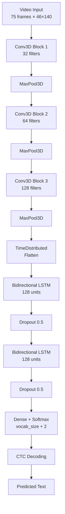

# Deep Lip Reading Project

<div align="center">

**An end-to-end deep learning project for lip reading from video**

[](https://www.python.org/)
[](https://www.tensorflow.org/)
[](LICENSE)

*Designed for accessibility applications*

</div>

---

An end-to-end deep learning project for lip reading from video, designed for accessibility applications. This project implements a Conv3D + Bidirectional LSTM + CTC architecture similar to LipNet, capable of transcribing speech from mouth region video clips.

<div align="center">
  
  <br/>
  <em>The preprocessed mouth region (grayscale, cropped, normalized) that the model reads from.</em>
</div>

## Overview

This project builds a machine learning model that can read lips from video sequences (mouth region only). The model uses:
- **3D Convolutional Networks** to extract spatiotemporal features from video frames
- **Bidirectional LSTM** layers to model temporal dependencies
- **CTC (Connectionist Temporal Classification)** loss for sequence-to-sequence learning

## Architecture

### Model Pipeline

```
Video Input (75 frames)
    ↓
[Mouth Region Extraction]
    ↓
[Grayscale + Normalization]
    ↓
Conv3D Block 1 (32 filters) → MaxPool3D
    ↓
Conv3D Block 2 (64 filters) → MaxPool3D
    ↓
Conv3D Block 3 (128 filters) → MaxPool3D
    ↓
TimeDistributed Flatten
    ↓
Bidirectional LSTM (128 units) → Dropout (0.5)
    ↓
Bidirectional LSTM (128 units) → Dropout (0.5)
    ↓
Dense Layer (Softmax, vocab_size + 2)
    ↓
CTC Decoding
    ↓
Predicted Text
```

### Architecture Details

The model architecture consists of:
1. **Input**: Video clips of shape `[batch, 75, H, W, 1]` (75 frames, grayscale mouth region)
2. **Conv3D Blocks**: Three 3D convolutional layers (32, 64, 128 filters, configurable via `CONV3D_FILTERS`) with MaxPool3D to extract features
3. **TimeDistributed Flatten**: Collapses spatial dimensions while preserving temporal dimension
4. **Bidirectional LSTM**: Two layers with 128 units each for sequence modeling
5. **Dropout**: Regularization (0.5 rate)
6. **Dense Output**: Softmax layer with `vocab_size + 2` outputs: character ids `1..vocab_size` (id `0` is reserved for padding) plus a dedicated CTC blank token at the final index

**Total parameters**: ~12 million (11,955,047 with the default config)

### Visual Architecture Diagram


```mermaid
graph TD
    A[Video Input<br/>75 frames × 46×140] --> B[Conv3D Block 1<br/>32 filters]
    B --> C[MaxPool3D]
    C --> D[Conv3D Block 2<br/>64 filters]
    D --> E[MaxPool3D]
    E --> F[Conv3D Block 3<br/>128 filters]
    F --> G[MaxPool3D]
    G --> H[TimeDistributed<br/>Flatten]
    H --> I[Bidirectional LSTM<br/>128 units]
    I --> J[Dropout 0.5]
    J --> K[Bidirectional LSTM<br/>128 units]
    K --> L[Dropout 0.5]
    L --> M[Dense + Softmax<br/>vocab_size + 2]
    M --> N[CTC Decoding]
    N --> O[Predicted Text]
```

## Project Structure

```
deeplip/
├── requirements.txt          # Runtime dependencies
├── requirements-dev.txt      # Test and lint dependencies
├── README.md                 # This file
├── DATA_SOURCES.md           # Where to get the GRID corpus
├── fetch_grid.py             # Resumable GRID downloader
├── eval_sample.py            # Qualitative checkpoint evaluation
├── src/
│   ├── __init__.py
│   ├── config.py             # Configuration and hyperparameters
│   ├── data.py               # Data loading and preprocessing
│   ├── dataset.py            # tf.data pipeline and vocabulary
│   ├── model.py              # Neural network architecture
│   ├── losses.py             # CTC loss function
│   ├── callbacks.py          # Training callbacks
│   ├── train.py              # Training script
│   ├── predict.py            # Inference script
│   └── visualize.py          # Visualization utilities
├── tests/                    # pytest suite (synthetic fixtures)
└── docs/
    └── demo.gif              # Preprocessed mouth-region sample
```

## Installation

1. **Clone the repository** (if applicable) or navigate to the project directory.

2. **Install dependencies**:
   ```bash
   pip install -r requirements.txt
   ```

   Required packages:
   - TensorFlow 2.x
   - NumPy
   - OpenCV-Python
   - Matplotlib
   - imageio
   - gdown

3. **Install development dependencies** (optional, for tests and linting):
   ```bash
   pip install -r requirements-dev.txt
   ```

## Data Setup

### Downloading Data

This project trains on the GRID corpus (see [DATA_SOURCES.md](DATA_SOURCES.md)). Download it
from Zenodo with the included resumable downloader:

```bash
python fetch_grid.py
```

This writes the speaker video zips and `alignments.zip` into `downloads/` (it can be re-run to
resume if the connection drops). Extract them so videos live under `data/<speaker>/` and
alignments under `data/alignments/<speaker>/`:

```
data/
├── s1/
│   ├── bbaf2n.mpg
│   ├── bbaf3s.mpg
│   └── ...
└── alignments/
    └── s1/
        ├── bbaf2n.align
        ├── bbaf3s.align
        └── ...
```

The `data/` directory is gitignored and is not shipped with the repository.

### Data Format

- **Videos**: MPEG files containing face videos
- **Alignments**: Text files with format:
  ```
  start_time end_time token
  start_time end_time token
  ...
  ```
  Tokens marked as "silence" are automatically filtered out.

### Data Notes

Each `.align` file gives the word-level transcript for its clip in `start end token` format;
`sil` (silence) tokens are filtered out during loading and the remaining tokens are joined into
the target string. The `data/` directory is gitignored, so download and extract the corpus
locally before training (see above). The test suite does not need it: it generates small
synthetic clips on the fly, so `pytest` runs fully offline.

## Usage

### Training

To train the model:

```bash
python -m src.train --video_pattern "data/s1/*.mpg" --epochs 50
```

Arguments:
- `--video_pattern`: Glob pattern for video files (default: `data/s1/*.mpg`)
- `--epochs`: Number of training epochs (default: 100)

To train a speaker-independent model across all speakers, point the pattern at every speaker
directory, e.g. `--video_pattern "data/s*/*.mpg"`.

The training script will:
1. Load and preprocess videos and alignments
2. Build the tf.data pipeline with padding and batching
3. Split data into training (450 samples) and validation sets
4. Train the model with CTC loss
5. Save weights after each epoch to `models/` directory
6. Print example predictions at the end of each epoch

**Training Configuration**:
- Batch size: 2
- Learning rate: 1e-4 (constant for first 30 epochs, then exponential decay)
- Video frames: 75 (padded/truncated)
- Max text length: 40 tokens

### Prediction

To predict text from a video clip:

```bash
python -m src.predict path/to/video.mpg --weights models/weights_epoch_50.h5
```

Arguments:
- `video_path`: Path to video file
- `--weights`: Path to model weights file (default: `models/weights_epoch_01.h5`). Checkpoints are
  written as `weights_epoch_NN.h5` after each training epoch; point this at whichever epoch you
  want to load.
- `--decoding`: CTC decoding strategy, `greedy` or `beam` (default: `greedy`). Beam search explores
  multiple candidate paths instead of always taking the single most likely character at each
  timestep, which tends to do better on short or ambiguous tokens (single letters, digits).
- `--beam_width`: Search width for beam-search decoding, ignored when `--decoding greedy` (default:
  `100`, see `BEAM_WIDTH` in `src/config.py`).

```bash
python -m src.predict path/to/video.mpg --weights models/weights_epoch_50.h5 --decoding beam
```

The script will:
1. Load the trained model
2. Preprocess the video (grayscale, crop mouth region, normalize)
3. Run inference using CTC decoding (greedy or beam search)
4. Print the predicted text

### Evaluation

`eval_sample.py` runs a checkpoint over a sample of clips and reports word error rate (WER) and
character error rate (CER) against the real `.align` transcripts, using `src/metrics.py`:

```bash
python eval_sample.py --weights models/weights_epoch_41.h5 --pattern "data/s1/*.mpg" --num 10
```

**Real numbers**, computed over all 1000 GRID speaker `s1` clips against epoch 41 (the
checkpoint with the lowest validation loss, ~27.24):

| Decoding | WER | CER |
|---|---|---|
| Greedy | 0.565 | 0.286 |
| Beam search | 0.554 | 0.262 |

Beam search improves both metrics, most noticeably on the short/ambiguous tokens (single letters,
digits) called out below. These numbers are single-speaker, in-distribution results - the
train/val split wasn't seeded, so it can't be reproduced as a clean held-out evaluation from
outside the training run (see [PROJECT_STATUS.md](PROJECT_STATUS.md) for the full caveat).

`src/metrics.py` also works standalone, if you want to score predictions some other way:

```python
from src.metrics import word_error_rate, character_error_rate

word_error_rate("set blue at one please", "set red at one please")       # 0.2
character_error_rate("bin blue", "bin glue")                              # 0.125
```

### Visualization

To visualize what the model sees (preprocessed mouth region), use the visualization utility:

```python
from src.visualize import visualize_preprocessed_clip
visualize_preprocessed_clip("data/s1/bbaf2n.mpg", "animation.gif")
```

This creates an animated GIF showing the preprocessed mouth region frames that the model processes.

## Configuration

All hyperparameters and paths can be modified in `src/config.py`:

- **Data paths**: `DATA_DIR`, `DATA_URL`, `ALIGNMENTS_DIR`
- **Preprocessing**: `MOUTH_REGION`, `TARGET_FRAMES`, `MAX_TEXT_LENGTH`
- **Model**: `CONV3D_FILTERS`, `LSTM_UNITS`, `DROPOUT_RATE`
- **Training**: `BATCH_SIZE`, `EPOCHS`, `INITIAL_LEARNING_RATE`

## GPU Configuration

The training script automatically configures GPU memory growth to avoid OOM errors. If you have multiple GPUs, TensorFlow will use the first available GPU.

## Model Output

- **Training**: Model weights are saved to `models/weights_epoch_XX.h5` after each epoch
- **Predictions**: Text strings decoded from video sequences
- **Monitoring**: Example predictions are printed during training to track progress

## Testing

- **Automated test suite**: A pytest suite lives under `tests/`, covering `config`, `data`,
  `dataset`, `model`, `losses`, `callbacks`, `predict`, `train`, `visualize`, and `metrics` (64
  tests, 93-94% coverage of `src/` - varies slightly with whether TensorFlow detects a GPU on
  the machine running them). All fixtures are synthetic (generated on the fly with OpenCV), so
  the suite runs fully offline without the gitignored `data/` directory. Run it with:
  ```bash
  pip install -r requirements-dev.txt
  pytest --cov=src --cov-report=term-missing
  ```
- **Linting**: A flake8 configuration is provided (`.flake8`). Run it with:
  ```bash
  flake8 src/ tests/
  ```
- **Static checks**: The codebase is kept clean of unused imports/dead code, verified with:
  ```bash
  python3 -m pyflakes src/ tests/
  ```
- **CI**: GitHub Actions (`.github/workflows/ci.yml`) runs flake8 and the pytest suite on every
  push and pull request to `main`.
- **Not covered**: `src/train.py`'s CLI entry point (`if __name__ == "__main__":`) and the
  GPU-memory-growth branch of `setup_gpu()` (no GPU in CI) are not exercised by tests.

## Security

This project follows security best practices:

### Input Validation
- All file paths are validated before processing
- Video files are checked for valid formats and structure
- Alignment files are parsed with error handling to prevent injection attacks

### Credential Management
- **Never commit secrets**: All `.env` files and `/secrets/` directories are excluded via `.gitignore`
- Use environment variables for sensitive configuration (e.g., API keys, data URLs)
- If using Google Drive downloads, ensure shareable links are set to "Anyone with the link can view" rather than embedding credentials

### Secure Practices
- No use of `eval()` or unsafe code execution
- File operations use context managers (`with` statements) for safe resource handling
- All external data downloads use HTTPS connections
- Model weights and checkpoints are excluded from version control

### Recommendations
- Review `src/config.py` before setting `DATA_URL` to ensure no credentials are hardcoded
- Use virtual environments to isolate dependencies
- Regularly update dependencies to patch security vulnerabilities

## Notes

- The model expects videos with a consistent mouth region location (configured via `MOUTH_REGION` in `config.py`)
- For best results, ensure videos are preprocessed consistently with training data
- CTC decoding defaults to a greedy strategy; pass `--decoding beam` to `src.predict` or
  `eval_sample.py` for beam search instead (see `BEAM_WIDTH` in `src/config.py`)
- The vocabulary includes lowercase letters, digits, and space (modify `VOCAB` in `config.py` if needed)

## License

This project is licensed under the [MIT License](LICENSE).

Separately, please ensure you have appropriate permissions for any datasets used (see
[DATA_SOURCES.md](DATA_SOURCES.md) for licensing notes on GRID, MIRACL-VC1, etc.). The MIT
license covers this repository's code only, not any third-party data.

## Demo / Example

The clip at the top of this README shows the preprocessed mouth region the model reads from.
Example predictions from epoch 41 (greedy decoding) on GRID speaker `s1`:

```
Ground truth: set white at v one again
Predicted:    set white at one again

Ground truth: place red in c four please
Predicted:    place red in fo please

Ground truth: bin blue at f two now
Predicted:    bin bl fo now
```

Command words, colors, prepositions, and adverbs come through reliably; the single letter and
digit tokens are the hardest classes on a single-speaker model and account for most of the
remaining errors. Regenerate the visualization for any clip:

```python
from src.visualize import visualize_preprocessed_clip
visualize_preprocessed_clip("data/s1/bbaf2n.mpg", "docs/demo.gif")
```

## Acknowledgments

This implementation is inspired by LipNet and similar lip-reading architectures, adapted for the GRID dataset format.

---

<div align="center">

**Built for accessibility applications**

[Report Bug](https://github.com/zaydabash/deeplip/issues) | [Request Feature](https://github.com/zaydabash/deeplip/issues) | [Documentation](README.md)

</div>

